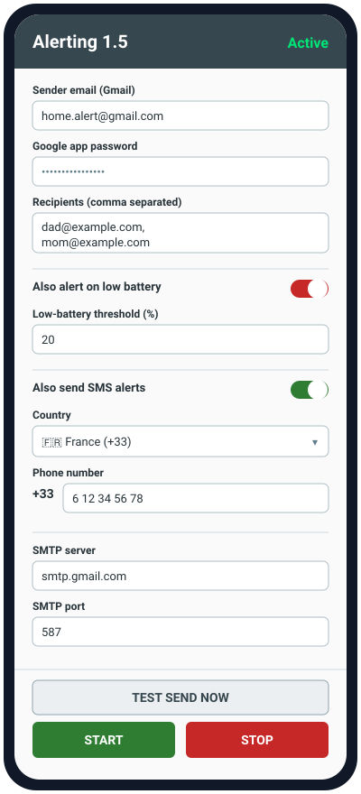
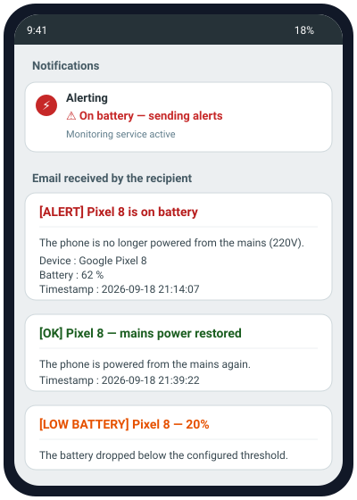

# Alerting — email alert on mains power (220V) loss

Android app that monitors the phone's mains power. When the phone is unplugged from
the wall it sends an alert (email, plus SMS if enabled), and it sends another when
mains power is restored. Optionally it also alerts when the battery drops below a
configurable threshold.

Emails are sent through a Gmail account (SMTP) using a **Google app password**.

## Screenshots

> These are high-fidelity **design mockups** of the app (the layout matches the
> actual UI), not device screenshots.

| Settings screen | Notification & alert emails |
|---|---|
|  |  |

## Features

- Email alert when mains power is lost, and again when it is restored (one each,
  no periodic repeats).
- **Multiple recipients** (comma / semicolon / newline separated).
- **Low-battery alert** with an on/off toggle and a configurable threshold —
  sent once when the battery crosses below the threshold, only while on battery.
- **SMS alerts** (optional toggle): sends a text message (if a SIM is present) to
  **up to two numbers**, each with its own country/dial code, on the key events
  (power lost, power restored, low battery). The country picker shows flags in the
  list and collapses to just the dial code once selected; numbers are validated per
  country (libphonenumber). Enabling the toggle requires a SIM (physical or eSIM).
- **"Test send now"** button: sends a test email and, if SMS alerts are enabled, a
  test SMS to each configured number.
- Automatic restart of monitoring after a phone reboot.
- Live status in the header: **Active** (green) / **Stopped** (red).
- All parameters editable in the app (sender email, app password, recipients,
  low-battery threshold, phone number, SMTP host/port).
- App password stored encrypted (EncryptedSharedPreferences).

## 1. Google prerequisite (app password)

Google no longer allows SMTP sending with your normal account password.

1. Enable **2-Step Verification** on the sending Gmail account:
   https://myaccount.google.com/security
2. Generate an **app password**:
   https://myaccount.google.com/apppasswords
3. Copy the 16-character value — that is what you enter in the app
   ("Google app password" field).

## 2. Build the APK (cloud build, nothing to install)

The project builds automatically via **GitHub Actions** and produces a **signed
release APK**.

- Every push to `main` builds the APK and uploads it as the **`alerting-apk`**
  artifact (Actions tab → latest run → Artifacts).
- Pushing a **`v*` git tag** additionally publishes a **GitHub Release** with the
  APK attached (see *Releasing a new version* below) — this is the easiest place
  to grab "the latest version".

## 3. Install on the phone

1. Download the APK (`alerting-<version>.apk`) from the latest **Release**
   (Releases page) or from the `alerting-apk` artifact.
2. Transfer it to the phone, allow installation from unknown sources, install it.
3. Open the app, fill in the fields, tap **Start**.
4. Accept the **notifications** permission prompt (Android 13+).

### If Play Protect warns or blocks the install

This is a self-signed, sideloaded app with no Google "reputation", so Play Protect
may warn or block it. This is expected — there is no code trick to bypass it. To
proceed (your own app, personal use):

- **Force the install:** on the warning, tap **More details → Install anyway**
  (or "Install without scanning").
- **If it is hard-blocked:** temporarily turn off scanning — Play Store → profile
  icon → **Play Protect** → ⚙️ (settings) → disable **"Scan apps with Play
  Protect"**, install the APK, then turn it back on.
- The app is signed with a **stable key**, so once you have accepted it, updates
  signed with the same key are recognized as the same app.

> For a zero-warning experience you would have to distribute via Google Play
> (internal testing track), which needs a Play Console account.

## Updating the app

The APK is signed with a **stable key** committed in the repo
(`app/alerting-release.keystore`) and each build gets an increasing `versionCode`.
Because the signature is stable, a newer version **installs on top of the old one
and keeps your settings** — no uninstall needed.

The app also **checks for updates on launch**: if a newer GitHub Release exists, it
shows an "Update available" dialog with a **Download** button that opens the APK
download. (Silent if offline or no newer version.)

To update:

1. When the "Update available" dialog appears, tap **Download** (or grab the newer
   `alerting-<version>.apk` from the latest **Release** manually).
2. Install it over the existing app. Android recognizes it as an update.

> Security note: the signing key lives in the (public) repo, which is fine for
> personal sideloading — it only guarantees consistent signatures for your own
> updates. For wider distribution, move the keystore and passwords into GitHub
> **Secrets** and reference them from the workflow instead.

## Releasing a new version

```bash
# after committing your changes on main
git tag v1.2
git push origin v1.2
```

Pushing the tag triggers the workflow, which builds the signed APK, sets
`versionName` from the tag (`v1.2` → `1.2`) and `versionCode` from the run number,
and publishes a GitHub Release with the APK attached.

## 4. Background reliability (IMPORTANT)

Some manufacturers (Samsung, Xiaomi, Huawei, Oppo…) aggressively kill background
services. To make sure alerts are sent:

- Settings → Apps → **Alerting** → Battery → **Unrestricted / Allow background
  activity**.
- Disable battery optimization for this app.

Without this, the system may kill the service and no emails will be sent.

### After a reboot (auto-start)

To resume monitoring automatically after the phone restarts, the app must be
allowed to **auto-start**. On most custom skins this is **off by default**, so
after a reboot nothing happens until you reopen the app and press Start again.

Enable auto-start for **Alerting** (names vary by brand):

- **Xiaomi / Redmi (MIUI):** Settings → Apps → Manage apps → Alerting → **Autostart** = on.
- **Huawei:** Settings → Apps → Alerting → **App launch** → Manage manually → enable
  *Auto-launch* + *Run in background*.
- **Oppo / Realme (ColorOS):** Settings → Apps → Alerting → **Allow Auto Launch**.
- **Samsung:** Settings → Battery → Background usage limits → make sure Alerting is
  **not** in "Sleeping/Deep sleeping apps"; set the app to **Unrestricted**.
- **Stock Android / Pixel:** no extra step beyond unrestricted battery.

After granting auto-start, do one Start so the setting is saved; monitoring should
then resume on its own after each reboot.

## 5. How it works

| Event | Action |
|---|---|
| Mains power unplugged | One email alert |
| Mains power restored | One restored-power email |
| Battery drops below threshold (if enabled) | One low-battery email (once per crossing) |
| Phone reboot | Monitoring resumes if it was active |

If **SMS alerts** are enabled, a text message is also sent on power-lost,
power-restored and low-battery (once each) — only if a SIM card is present. SMS
uses the monitored phone's SIM and consumes its SMS allowance, and requires the
`SEND_SMS` permission (requested when you enable the toggle).

> Note: detection is based on power connect/disconnect (mains or USB). A 220V wall
> charger maps to the "powered" state.

## 6. Development / tests

Business logic is tested on the pure JVM (no device required):

```bash
gradle testDebugUnitTest
```

- `AlertStateMachine` — mains ↔ battery transitions.
- `AlertSettings` — parameter validation, multi-recipient parsing, low-battery
  threshold rules.

## Project structure

```
app/src/main/java/com/sophiaengineering/alerting/
  AlertSettings.kt         # data class + validation + recipient parsing (pure)
  AlertStateMachine.kt     # transition logic (pure)
  EmailSender.kt           # interface
  SmtpEmailSender.kt       # SMTP sending (JavaMail), multi-recipient
  SettingsStore.kt         # encrypted persistence
  MonitoringService.kt     # foreground service + timer loop + battery watch
  PowerConnectionReceiver.kt
  BootReceiver.kt
  SettingsActivity.kt      # settings UI + test-send button
```

Design spec (French): `docs/superpowers/specs/2026-09-18-alerting-power-email-design.md`
